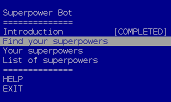

# Superpower Finder Bot



## What
'Find your superpower' bot

## So What
Knowing everyone's superpower on a team helps the team to communicate more effectively and provide insight into the team's operating model.

## Now What

Install
```
git clone git@github.com:oren/superpower.git
cd superpower
crystal build src/superpower.cr
```

Run
```
./superpower

```

## Architecture

### System Context
The bot can be operated from the command line or from a website. Both interfaces use HTTP API to access the logic of the bot.

The Bot has 4 parts:
* CLI - command line interface
* Webite - web interface
* Server - HTTP API
* Core - Bot's logic

## Questions
* Can the CLI skip the HTTP API and talk directly to the core?
* Where does the Bot store it's content?
* Is there a need for a Database?
